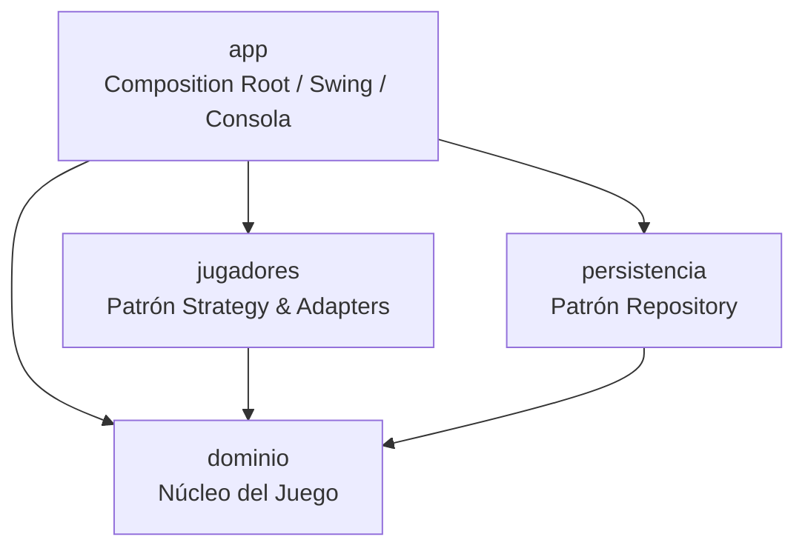

# 🕵️‍♂️ Adivina Quién — Trabajo Práctico Obligatorio

**Asignatura:** Diseño y Análisis de Algoritmos  
**Docente:** López Juan Ignacio  
**Institución:** UADE  
**Fecha de Entrega:** 28 de septiembre de 2026  
**Integrantes:** Bruno Capriz, Roquina Brochero  

---

## 📌 Descripción del Proyecto

**Adivina Quién** es una implementación orientada a objetos, modularizada y altamente desarticulada del clásico juego de adivinanzas entre dos jugadores. Cada jugador posee un personaje secreto y el rival intenta identificarlo mediante preguntas cerradas (filtros por género, calvicie, uso de lentes o color de pelo) o arriesgando un nombre directamente.

El eje central del sistema es el modelado de las partidas como un problema de **reducción del espacio de búsqueda** mediante **Divide y Conquista (D&C)**, combinado con una **Estrategia Greedy (Voraz)** para la toma de decisiones óptimas en cada turno.

### 🚀 Características Clave

* **Algoritmos y Heurísticas:**
  * **Divide & Conquer (D&C):** Utilizado para el reordenamiento alfabético inicial del roster de personajes mediante **MergeSort** $\Theta(n \log n)$ y para la partición y descarte en el espacio de búsqueda.
  * **Estrategia Greedy:** Minimización del peor caso posible de reducción del espacio candidato en cada turno.
* **3 Modos de Juego:**
  1. **Humano vs Máquina** (Básica o Asertiva)
  2. **Espectador:** Máquina vs Máquina (con control de tiempo y logs de eventos via Observer).
  3. **Humano vs Humano** (a través de la UI Swing).
* **Soporte Dual de Interfaz:** Soporte completo tanto por **Consola (CLI)** como por **Interfaz Gráfica (Swing GUI)**.
* **Arquitectura Hexagonal (Ports & Adapters):** Aislamiento estricto del núcleo de dominio respecto de la interfaz de usuario, las estrategias de los jugadores y la persistencia.

---

## 🏗️ Arquitectura del Sistema

El proyecto está estructurado como un **repositorio multi-módulo Apache Maven** compuesto por **4 módulos independientes**:

```
.
├── dominio       # Núcleo del juego (Personajes, Espacio de Búsqueda, Reglas, Interfaces Observer/Repository)
├── jugadores     # Implementación del patrón Strategy para las máquinas (Básica y Asertiva) y Adapters
├── persistencia  # Patrón Repository para almacenar el marcador y puntuaciones en disco
└── app           # Composition Root: Consola, Interfaz Swing, Main y orquestación
```

### Diagrama de Dependencias entre Módulos



### Patrones de Diseño Implementados

* **Strategy:** Máquinas e interfaces de jugador (`Jugador`, `MaquinaBasica`, `MaquinaAsertiva`).
* **Template Method:** `MotorDeBusquedaDeMaquina` fija la estructura general de decisiones turno a turno y delega la selección del filtro (`elegirFiltro`).
* **Observer:** `Partida` notifica eventos a `ObservadorDePartida` (implementado en CLI y en `PartidaObserverSwing`).
* **Adapter:** `ConsolaJugadorHumano` y `SwingJugadorHumano` adaptan la entrada humana a la interfaz `Jugador`.
* **Repository:** `MarcadorRepository` desacopla la persistencia del marcador.

---

## 🧠 Algoritmos Implementados & Justificación

### 1. Divide & Conquer (D&C)

#### A. Ordenamiento Inicial del Roster (MergeSort)
* **Algoritmo:** **MergeSort** ($\Theta(n \log n)$).
* **Justificación:** Se prefiere sobre QuickSort para garantizar la estabilidad del ordenamiento y evitar la degradación a $\Theta(n^2)$ cuando la lista inicial llega parcialmente ordenada (agrupada por género).
* **Ecuación de Recurrencia:**
  
  $$T(n) = 2T(n/2) + \Theta(n) \implies \Theta(n \log n)$$

#### B. Partición del Espacio de Búsqueda
En cada turno, la respuesta del rival (SÍ / NO) aplica un filtro que divide el conjunto de candidatos vigentes en dos subconjuntos complementarios:

$$\text{Espacio}_{t+1} = \{ c \in \text{Espacio}_t \mid \text{filtro}(c) = \text{respuesta} \}$$

* **Descarte Puntual:** Cuando una adivinanza directa es incorrecta, se remueve únicamente dicho personaje en $\Theta(n)$.

---

### 2. Estrategia Greedy (Máquina Asertiva)

La **Máquina Asertiva** evalúa todas las categorías y valores posibles $f \in F$ para seleccionar el filtro que minimiza el tamaño del subconjunto restante en el **peor caso**:

$$\text{Filtro Elegido} = \arg\min_{f \in F} \left( \max(\vert{}S_{f, \text{sí}}\vert{}, \vert{}S_{f, \text{no}}\vert{}) \right)$$

* **Variante Informada:** Reutiliza la función de selección y rompe empates priorizando categorías no exploradas por el rival para evitar redundancia.

---

## 📊 Análisis de Complejidad (Big O)

| Subsistema / Operación | Complejidad Temporal | Complejidad Espacial | Descripción |
| :--- | :---: | :---: | :--- |
| **Alta de Personajes** | $\mathcal{O}(1)$ | $\mathcal{O}(1)$ | Inserción directa en lista con asignación de ID. |
| **MergeSort (Roster Inicial)** | $\Theta(n \log n)$ | $\Theta(n)$ | Garantizado en el peor caso con espacio auxiliar. |
| **Aplicar Filtro** | $\Theta(n)$ | $\mathcal{O}(n)$ | Recorrido lineal sobre los candidatos vigentes. |
| **Filtro Greedy (Básica)** | $\Theta(1)$ | $\mathcal{O}(1)$ | Selección ciega según orden preseteado. |
| **Filtro Greedy (Asertiva)** | $\Theta(k \cdot v \cdot n) \to \Theta(n)$ | $\mathcal{O}(n)$ | $k \le 4$ categorías, $v \le 3$ valores posibles. |
| **Partida Completa** | $\Theta(n \log n)$ | $\mathcal{O}(n)$ | $\approx \lceil \log_2 n \rceil$ turnos con evaluación lineal. |
| **Persistencia (Marcador)** | $\mathcal{O}(m)$ | $\mathcal{O}(m)$ | Lectura/Escritura completa de $m$ registros. |

---

## ⚖️ Comparativa Empírica (Benchmark)

Se ejecutó una prueba empírica (`OrdenadorDePersonajesBenchmarkTest`) comparando **MergeSort** frente a **Bubble Sort** sobre 10.000 iteraciones con $n=23$:

| Algoritmo | Complejidad Teórica | Tiempo por Corrida ($n=23$) |
| :--- | :---: | :---: |
| **MergeSort** | $\Theta(n \log n)$ | $\approx 0{,}005 - 0{,}018\text{ ms}$ |
| **Bubble Sort** | $\Theta(n^2)$ | $\approx 0{,}003 - 0{,}008\text{ ms}$ |

> **Conclusión:** Para $n=23$, Bubble Sort demuestra menores tiempos debido al costo constante de la asignación de memoria y recursión de MergeSort. Sin embargo, se mantiene **MergeSort** en el sistema para garantizar estabilidad y escalabilidad asintótica sin sorpresas de peor caso $O(n^2)$.
> 

---

## 🛠️ Tecnologías Utilizadas

* **Lenguaje:** Java 26
* **Construcción:** Apache Maven
* **Interfaz de Usuario:** Java Swing & AWT
* **Pruebas Unitarias:** JUnit 5
* **Entorno de Desarrollo:** IntelliJ IDEA
